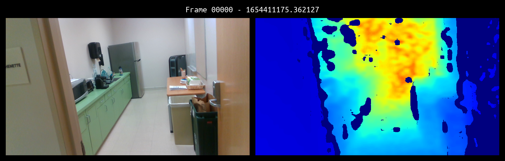

# maya-slam
Maya Archaeology VR - Project for CSE 237D Course Spring 2022

This repository contains the code for data recording, visual-inertial SLAM, and dense reconstruction. The VR part of this project can be found in the [main repository on GitLab](https://gitlab.nrp-nautilus.io/tsharkey/maya-archeology-unity).

An example collected RGB-D sequence can be view in the video below.  
[](https://drive.google.com/file/d/1rs-0pipUUZarRR7YuHHC-0TRISR8JfdM/view?usp=sharing)

The reconstructed mesh with 5 mm TSDF voxel resolution and camera pose refinement is shown below.  


## Group Members
  * Kolin Guo
  * Shrutheesh Iyer
  * Tommy Sharkey

## D435i IMU Calibration
The steps are mainly summaries taken from
[Intel D435i IMU Calibration Guide](https://www.intelrealsense.com/wp-content/uploads/2019/07/Intel_RealSense_Depth_D435i_IMU_Calibration.pdf)
and their [official RealSense SDK](https://github.com/IntelRealSense/librealsense).  
If there is anything unclear or any software change occur, refer to them for
any updates.  
Our calibration results are included in [d435i_imu_calibration/](d435i_imu_calibration).

<details>
<summary><b><font size="+1">Detailed steps to perform IMU calibration of D435i on Ubuntu</font></b></summary>
<p>

Prerequisites: Ubuntu >= 18.04, Python 3 (pip, numpy)

* Step 1: Install Intel RealSense SDK `pyrealsense2` wrapper:  
  ```bash
  sudo pip3 install pyrealsense2
  ```
* Step 2: Clone [Intel RealSense SDK](https://github.com/IntelRealSense/librealsense):  
  ```bash
  git clone https://github.com/IntelRealSense/librealsense.git
  ```
* Step 3: Run `librealsense/tools/rs-imu-calibration/rs-imu-calibration.py` with sudo
  to perform IMU calibration.
  Check [this README.md](https://github.com/IntelRealSense/librealsense/tree/master/tools/rs-imu-calibration)
  for more information.  
  ```bash
  cd librealsense/tools/rs-imu-calibration
  sudo python3 rs-imu-calibration.py
  ```
* Step 4: At the end of the calibration script, select to write the results to D435i's eeprom.

Note that if you are connected to a laptop, your screen might rotate according
to the connected D435i orientation. This is because the OS sees the IMU inside
D435i as any IMU inside a tablet and thus will rotate screen orientation following
it. To turn screen rotation off, see
[this post](https://askubuntu.com/questions/1035209/how-to-turn-off-screen-rotation-in-ubuntu-18-04-lts).

</p>
</details>

## Data Recording and Reconstruction Workflow
The steps to run the entire system are:
1. Pull the docker images and build the containers with `./docker_setup.sh <container-name>`.  
   Alternatively, run `./docker_setup.sh <container-name> -l` to build docker images locally
   from the Dockerfiles.  
   When building the container for the first time, copy and run the "*Command to compile*" in the login banner.
2. Open camera using `./realsense_capture/start_camera.sh` from `realsense_capture` container.
3. Start tracking using `./slam_algorithms/maplab/run_maplab.sh <bag-name>` from `maplab` container.
4. Stop tracking by pressing `<ctrl-c>` and stopping the containers.
5. Reconstruct 3D mesh by running the following python script inside `maya_recon` container.
    ```bash
    python3 /maya-slam/scene_recon/open3d_tsdf/open3d_tsdf_reconstruction.py <bag-path> --voxel-length <voxel-length> --pose-refine
    ```
6. Split mesh into chunks by running the following python script inside `maya_recon` container.
    ```bash
    python3 /maya-slam/scene_recon/split_mesh_into_json.py <ply-path> --box-size <box-size>
    ```
Some helpful scripts for visualization (all of them should be run inside `maya_recon` container):
* Convert a rosbag to an MP4 video with RGB and depth images:
  ```bash
  python3 /maya-slam/tools/rosbag_to_video.py <bag-path>
  ```
* Visualize PLY meshes or the split meshes
(supports up to 4 meshes at the same time,
usage examples can be found in the python script
[visualize_mesh.py](tools/visualize_mesh.py#L3-L14)):
  ```bash
  python3 /maya-slam/tools/visualize_mesh.py <ply-path>...
  ```

## Detail Descriptions of the System Modules and Their Docker Containers

<details>
<summary><font size="+2"><b>Camera Capture</b>: <i>realsense_capture</i></font></summary>
<p>

| docker image | Dockerfile | Estimated compile time |
| :-----: | :-----: | :-----: |
| [kolinguo/realsense:v1.0](https://hub.docker.com/r/kolinguo/realsense) | [docker/Dockerfile_realsense](docker/Dockerfile_realsense) | 1-2 minutes |

Container for launching and configuring the Intel RealSense D435i RGBD camera.  
This docker image has Ubuntu 18.04, CUDA 11.3.1, ROS Melodic, OpenCV 4.4.0,
[librealsense](https://github.com/IntelRealSense/librealsense),
[realsense-ros](https://github.com/IntelRealSense/realsense-ros).

#### Build & compile codebase
1. `./docker_setup.sh realsense_capture` to pull the docker image and build the container.
2. `cd realsense_capture && ./build_ros.sh` to compile the packages.

#### Running
Run `./realsense_capture/start_camera.sh` to start the camera.  
This will launch the launch file
[realsense_d435i_rviz.launch](realsense_capture/catkin_ws/src/realsense_d435i_capture/launch/realsense_d435i_rviz.launch).
It is configured to launch the RGB color feed (1280x720 @ 30 fps),
depth feed (848x480 @ 30 fps) aligned with color using
[HighAccuracyPreset](realsense_capture/catkin_ws/src/realsense_d435i_capture/json/HighAccuracyPreset.json),
and the IMU sensors (accel and gyro @ 200 fps).

##### Note: RealSense D435i depth presets and performance tuning
To obtain better performance of the D435i depth camera, we followed the
[post of RealSense D400 series visual presets](https://dev.intelrealsense.com/docs/d400-series-visual-presets)
and uses the HighAccuracyPreset.
All presets can be found
[here](https://github.com/IntelRealSense/librealsense/wiki/D400-Series-Visual-Presets#preset-table).
For the best performance, please check out the
[advanced guide for tuning depth cameras](https://dev.intelrealsense.com/docs/tuning-depth-cameras-for-best-performance).

</p>
</details>

<details>
<summary><font size="+2"><b>Visual-Inertial SLAM #1</b>: <i>maplab</i></font></summary>
<p>

| docker image | Dockerfile | Estimated compile time |
| :-----: | :-----: | :-----: |
| [kolinguo/maplab:v1.0](https://hub.docker.com/r/kolinguo/maplab) | [docker/Dockerfile_maplab](docker/Dockerfile_maplab) | 35-45 minutes |

Container for launching and configuring [maplab](https://github.com/ethz-asl/maplab),
which is a visual-inertial SLAM supporting RGB-D+IMU mapping.  
This docker image has Ubuntu 18.04, CUDA 11.3.1, ROS Melodic, OpenCV 4.4.0,
[librealsense](https://github.com/IntelRealSense/librealsense),
[realsense-ros](https://github.com/IntelRealSense/realsense-ros).

#### Build & compile codebase
1. `./docker_setup.sh maplab` to pull the docker image and build the container.
2. `cd slam_algorithms/maplab && ./build_ros.sh` to compile the packages.

#### Running
Run `./slam_algorithms/maplab/run_maplab.sh <bag-name>` to start the camera tracking.
It accepts a `<bag-name>` argument which will record and save the rosbag as
`/maya-slam/slam_algorithms/rosbags/d435i_{bag-name}_{TIMESTAMP}.bag`

The script will launch the launch file
[realsense.launch](slam_algorithms/maplab/catkin_ws/src/maplab/applications/rovioli/launch/realsense.launch).
It will run maplab by calling
[run_realsense](slam_algorithms/maplab/catkin_ws/src/maplab/applications/rovioli/scripts/run_realsense),
display the trajectory in RVIZ and
also record color/depth/imu/camera pose trajectory generated by maplab
as topics into a rosbag.
The RealSense camera parameters can be modified in
[realsense-camera.yaml](slam_algorithms/maplab/catkin_ws/src/maplab/applications/rovioli/share/realsense-camera.yaml)
and
[realsense-imu.yaml](slam_algorithms/maplab/catkin_ws/src/maplab/applications/rovioli/share/realsense-imu.yaml).

:mega: **Remember to update the camera parameters for your RealSense camera**

</p>
</details>

<details>
<summary><font size="+2"><b>Visual-Inertial SLAM #2</b>: <i>orbslam3</i></font></summary>
<p>

| docker image | Dockerfile | Estimated compile time |
| :-----: | :-----: | :-----: |
| [kolinguo/orbslam3:v1.0](https://hub.docker.com/r/kolinguo/orbslam3) | [docker/Dockerfile_orbslam3](docker/Dockerfile_orbslam3) | 5-6 minutes |

Container for launching and configuring
[ORB-SLAM3](https://github.com/UZ-SLAMLab/ORB_SLAM3), the state-of-the-art
ORB-feature-based visual-inertial SLAM algorithm on stereo+IMU system.  
This docker image has Ubuntu 18.04, CUDA 11.3.1, ROS Melodic, OpenCV 4.4.0,
[librealsense](https://github.com/IntelRealSense/librealsense),
[realsense-ros](https://github.com/IntelRealSense/realsense-ros),
Python 3.6.9 with Jupyter Notebook.

Unfortunately, for RGB-D+IMU systems such as the RealSense D435i, ORB-SLAM3 does not have great
performance and can sometimes lose track in featureless areas according to our experiments.

#### Build & compile codebase
1. `./docker_setup.sh orbslam3` to pull the docker image and build the container.
2. `cd slam_algorithms/ORB_SLAM3 && ./build.sh && ./build_ros.sh` to compile the packages.

#### Running
Run `roslaunch ORB_SLAM3 rgbd_d435i.launch` to launch tracking along with
RealSense camera.  
The trajectory is written as
`/maya-slam/slam_algorithms/ORB_SLAM3/Examples_old/ROS/ORB_SLAM3/FrameTrajectory.txt`

A Jupyter notebook
[Fix_ORBSLAM3_Lose_Track.ipynb](slam_algorithms/ORB_SLAM3/Examples_old/ROS/ORB_SLAM3/rosbags/notebooks/Fix_ORBSLAM3_Lose_Track.ipynb)
is included to fix any tracking loss in the ORB-SLAM3 camera pose trajectory
by performing a consecutive frame
[multi-scale ICP](http://www.open3d.org/docs/0.15.1/python_api/open3d.t.pipelines.odometry.rgbd_odometry_multi_scale.html)
of the two frames before and after losing track.
Although not included yet, rosbag generation from the predicted camera pose trajectory
can be easily written, enabling mesh reconstruction.

:exclamation: **ORB-SLAM3 has not been tested extensively for the project and we recommend using maplab for SLAM**

<details>
<summary><font size="+0">Running ORB-SLAM3 on SLAM Datasets</font></summary>
<p>

Please place all datasets in [slam_algorithms/datasets/](slam_algorithms/datasets/)  
For [TUM_VI](https://vision.in.tum.de/data/datasets/visual-inertial-dataset),
ORB-SLAM3 expects the data in raw format (i.e., *Euroc / DSO 512x512 dataset*)
instead of rosbags.

```bash
datasets
├── TUM_VI
│   ├── dataset-corridor1_512_16
│   │   ├── dso
│   │   │   ├── cam0
│   │   │   ├── cam1
│   │   │   ├── camchain.yaml
│   │   │   ├── gt_imu.csv
│   │   │   ├── imu_config.yaml
│   │   │   └── imu.txt
│   │   └── mav0
│   │       ├── cam0
│   │       │   ├── data
│   │       │   └── data.csv
│   │       ├── cam1
│   │       │   ├── data
│   │       │   └── data.csv
│   │       ├── imu0
│   │       │   └── data.csv
│   │       └── mocap0
│   │           └── data.csv
│   └── ...
└── EuRoC
```

##### Running ORB-SLAM3
Use [tum_vi_examples.sh](slam_algorithms/ORB_SLAM3/tum_vi_examples.sh)
to run with TUM_VI dataset.  
(Note: the seg fault at the end is not an issue since it only happens during destruction.)

</p>
</details>

</p>
</details>

<details>
<summary><font size="+2"><b>Convert Rosbag to MP4 Video</b>: <i>maya_recon</i></font></summary>
<p>

| docker image | Dockerfile | Estimated compile time |
| :-----: | :-----: | :-----: |
| [kolinguo/maya_recon:v1.0](https://hub.docker.com/r/kolinguo/maya_recon) | [docker/Dockerfile_maya_recon](docker/Dockerfile_maya_recon) | No need to compile |

Container for converting a rosbag to an MP4 video with RGB and depth images.  
Uses PIL and OpenCV for image editing and video generation.
Utilizes the custom [ImageHelper class](tools/image_helper.py) for
combining images and adding texts.  
This docker image has Ubuntu 20.04, CUDA 11.3.1, ROS Noetic, OpenCV 4.2.0,
Python 3.8.10 with Jupyter Notebook and [requirements.txt](scene_recon/requirements.txt).

#### Build
1. `./docker_setup.sh maya_recon` to pull the docker image and build the container.

#### Running
Run the following python script to convert the rosbag at `<bag-path>` into
an MP4 video. The generated video is saved as
`{bag-path}_bag_frames/{bag-name}_bag_frames.mp4`
  ```bash
  python3 ./tools/rosbag_to_video.py <bag-path>
  ```

</p>
</details>

<details>
<summary><font size="+2"><b>Dense Reconstruction #1</b>: <i>maya_recon</i></font></summary>
<p>

| docker image | Dockerfile | Estimated compile time |
| :-----: | :-----: | :-----: |
| [kolinguo/maya_recon:v1.0](https://hub.docker.com/r/kolinguo/maya_recon) | [docker/Dockerfile_maya_recon](docker/Dockerfile_maya_recon) | No need to compile |

Container for dense 3D mesh reconstruction from RGB-D observations and the estimated camera pose trajectory.  
Uses Open3D
[ScalableTSDFVolume](http://www.open3d.org/docs/0.15.1/python_api/open3d.pipelines.integration.ScalableTSDFVolume.html)
to reconstruct the scene. Supports adding a consecutive frame camera pose refinement step
to improve the estimated camera poses. The pose refinement is based on
[multi-scale ICP](http://www.open3d.org/docs/0.15.1/python_api/open3d.t.pipelines.odometry.rgbd_odometry_multi_scale.html).  
This docker image has Ubuntu 20.04, CUDA 11.3.1, ROS Noetic, OpenCV 4.2.0,
Python 3.8.10 with Jupyter Notebook and [requirements.txt](scene_recon/requirements.txt).

#### Build
1. `./docker_setup.sh maya_recon` to pull the docker image and build the container.

#### Running
Run the following python script to perform 3D reconstruction from the rosbag
(with the estimated camera pose recorded in `/tf` topic from `map` frame to `imu` frame)
at `<bag-path>`. The generated PLY mesh is saved as
`/maya-slam/scene_recon/output_plys/{bag-name}_o3dTSDF{voxel-length}m.ply`
  ```bash
  python3 ./scene_recon/open3d_tsdf/open3d_tsdf_reconstruction.py <bag-path> --voxel-length <voxel-length> --pose-refine
  ```

The TSDF `<voxel-length>` is specified in meters and should be tuned given the available
system RAM resources (*i.e.*, a smaller `<voxel-length>` gives more detailed geometries
but requires more RAM resources).  
If the option `--pose-refine` is specified, perform the additional pose refinement step
and save the refined pose trajectory in `output_plys/{ply-name}_pose` directory.
The `pose_trajectory.html` inside the directory shows the camera pose trajectory
visualizations for the SLAM estimate and the refined trajectory.

:zap: **We recommend running this dense reconstruction on a powerful system with >64GB RAM** :zap:

<details>
<summary><font size="+0">Some Jupyter Notebooks Containing Draft Code</font></summary>
<p>

Some Jupyter notebooks containing draft code are included in
[scene_recon/notebooks](scene_recon/notebooks).

* [Open3D_Dense_RGBD_SLAM.ipynb](scene_recon/notebooks/Open3D_Dense_RGBD_SLAM.ipynb):
  scene reconstruction using Open3D tensor-based
  [Dense RGBD SLAM](http://www.open3d.org/docs/0.15.1/tutorial/t_reconstruction_system/dense_slam.html).
  Probably due to the unstable implementation of the marching-cubes algorithm,
  the algorithm will always crashes the kernel during extracting the triangular mesh
  from the
  [VoxelBlockGrid](http://www.open3d.org/docs/0.15.1/python_api/open3d.t.geometry.VoxelBlockGrid.html).
* [Open3D_TSDF_integration.ipynb](scene_recon/notebooks/Open3D_TSDF_integration.ipynb):
  draft code for [open3d_tsdf_reconstruction.py](scene_recon/open3d_tsdf/open3d_tsdf_reconstruction.py).
* [Open3D_TSDF_integration_tensor.ipynb](scene_recon/notebooks/Open3D_TSDF_integration_tensor.ipynb):
  scene reconstruction using Open3D tensor-based
  [VoxelBlockGrid](http://www.open3d.org/docs/0.15.1/python_api/open3d.t.geometry.VoxelBlockGrid.html).
  Probably due to the unstable implementation of the marching-cubes algorithm,
  the algorithm will always crashes the kernel during extracting the triangular mesh.
* [PLY_vertex_color_to_face_color.ipynb](scene_recon/notebooks/PLY_vertex_color_to_face_color.ipynb):
  code for converting mesh per-vertex color information to per-face color information using
  [PolyData.point_data_to_cell_data()](https://docs.pyvista.org/api/core/_autosummary/pyvista.PolyData.point_data_to_cell_data.html).
  Not needed for this project.
* [Split_scene_and_json_generation.ipynb](scene_recon/notebooks/Split_scene_and_json_generation.ipynb):
  draft code for [split_mesh_into_json.py](scene_recon/split_mesh_into_json.py).

</p>
</details>

</p>
</details>

<details>
<summary><font size="+2"><b>Dense Reconstruction #2</b>: <i>openchisel</i></font></summary>
<p>

| docker image | Dockerfile | Estimated compile time |
| :-----: | :-----: | :-----: |
| [kolinguo/openchisel:v1.0](https://hub.docker.com/r/kolinguo/openchisel) | [docker/Dockerfile_openchisel](docker/Dockerfile_openchisel) | 1-2 minutes |

Container for dense 3D mesh reconstruction from RGB-D observations and the estimated camera pose trajectory.
Uses [OpenChisel](https://github.com/personalrobotics/OpenChisel)
to reconstruct the scene.  
This docker image has Ubuntu 18.04, CUDA 11.3.1, ROS Melodic,
[ros-melodic-pcl-ros](https://github.com/methylDragon/pcl-ros-tutorial/blob/master/PCL%20Reference%20with%20ROS.md).

#### Build & compile codebase
1. `./docker_setup.sh openchisel` to pull the docker image and build the container.
2. `cd scene_recon/openchisel && ./build_ros.sh` to compile the packages.

#### Running
Run `./scene_recon/openchisel/run_openchisel.sh <bag-path>` to start the reconstruction from the rosbag
(with the estimated camera pose recorded in `/tf` topic from `map` frame to `imu` frame)
at `<bag-path>`. The generated PLY mesh is saved as
`/maya-slam/scene_recon/output_plys/{bag-name}_openchisel.ply`

The script will launch the launch file
[launch_realsense_maplab.launch](scene_recon/openchisel/catkin_ws/src/OpenChisel/chisel_ros/launch/launch_realsense_maplab.launch).
The TSDF `<voxel_resolution_m>` parameter is specified in meters and can be tuned given the available
system RAM resources. However, OpenChisel seems to not function properly
when `<voxel_resolution_m>` is below 0.04 meter (*i.e.*, 4 cm), presumably due to suboptimal implementation.

:mega: **We recommend using the Open3D-based *maya_recon* for dense reconstruction**

</p>
</details>

<details>
<summary><font size="+2"><b>Split Mesh into Chunks</b>: <i>maya_recon</i></font></summary>
<p>

| docker image | Dockerfile | Estimated compile time |
| :-----: | :-----: | :-----: |
| [kolinguo/maya_recon:v1.0](https://hub.docker.com/r/kolinguo/maya_recon) | [docker/Dockerfile_maya_recon](docker/Dockerfile_maya_recon) | No need to compile |


Container for splitting mesh into chunks and generating the JSON configuration file
to speedup mesh loading and manipulation.  
Uses PyVista
[PolyData.clip_box()](https://docs.pyvista.org/api/core/_autosummary/pyvista.PolyData.clip_box.html)
function to clip the meshes.
Other 3D mesh processing libraries have not yet correctly implemented
texture interpolation during mesh clipping
(*e.g.*, [trimesh issue #1313](https://github.com/mikedh/trimesh/issues/1313),
[Open3D issue #2464](https://github.com/isl-org/Open3D/issues/2464)).  
This docker image has Ubuntu 20.04, CUDA 11.3.1, ROS Noetic, OpenCV 4.2.0,
Python 3.8.10 with Jupyter Notebook and [requirements.txt](scene_recon/requirements.txt).

#### Build
1. `./docker_setup.sh maya_recon` to pull the docker image and build the container.

#### Running
Run the following python script to split the mesh at `<ply-path>` into chunks
and generate a JSON configuration file.
The `<box-size>` is the chunk side length specified in meters
and should be tuned to balance the chunk PLY filesize and the number of split mesh chunks
to achieve the optimal mesh loading speed.

```bash
python3 ./scene_recon/split_mesh_into_json.py <ply-path> --box-size <box-size>
```

The generated files are saved in
`/maya-slam/scene_recon/output_plys/{ply-name}_split` directory.
An example folder structure is shown below
```bash
output_plys
├── d435i_kitchen_2022-06-04-23-39-35_o3dTSDF0.005m_pose_refined.ply
├── d435i_kitchen_2022-06-04-23-39-35_o3dTSDF0.005m_pose_refined_split
│   ├── meshes
│   │   ├── chunk_(0,0,0).ply
│   │   ├── chunk_(0,1,0).ply
│   │   ├── chunk_(-1,-1,0).ply
│   │   ├── chunk_(1,0,0).ply
│   │   └── ...
│   └── config.json
└── ...
```

:zap: **We recommend running this mesh splitting on a powerful system with 32GB RAM** :zap:

</p>
</details>

<details>
<summary><font size="+2"><b>Visualize Meshes</b>: <i>maya_recon</i></font></summary>
<p>

| docker image | Dockerfile | Estimated compile time |
| :-----: | :-----: | :-----: |
| [kolinguo/maya_recon:v1.0](https://hub.docker.com/r/kolinguo/maya_recon) | [docker/Dockerfile_maya_recon](docker/Dockerfile_maya_recon) | No need to compile |

Container for visualizing PLY meshes or the split mesh chunks.  
Uses [PyVista](https://docs.pyvista.org/) to load and visualize the meshes
due to its great efficiency of processing very large meshes
compared to other 3D mesh processing libraries (*e.g.*, trimesh and Open3D).  
This docker image has Ubuntu 20.04, CUDA 11.3.1, ROS Noetic, OpenCV 4.2.0,
Python 3.8.10 with Jupyter Notebook and [requirements.txt](scene_recon/requirements.txt).

#### Build
1. `./docker_setup.sh maya_recon` to pull the docker image and build the container.

#### Running
Run the following python script to visualize the mesh or the split mesh chunks
at `<ply-path>`
(supports up to 4 meshes at the same time,
usage examples can be found in the python script
[visualize_mesh.py](tools/visualize_mesh.py#L3-L14)):
  ```bash
  python3 ./tools/visualize_mesh.py <ply-path>...
  ```

</p>
</details>

## Video and Report
You can check out our video description below and our [final report here](https://drive.google.com/file/d/19Ro2_fz5rI_lMPYsiB1i2cJjAFTdzhrC/view?usp=sharing).  
[](https://www.youtube.com/watch?v=BEKNMh0L4R0)
 
## Credits
  1. [GitHub of maplab](https://github.com/ethz-asl/maplab)
  2. [GitHub of ORB-SLAM3](https://github.com/UZ-SLAMLab/ORB_SLAM3)
  2. [GitHub of OpenChisel](https://github.com/personalrobotics/OpenChisel)
